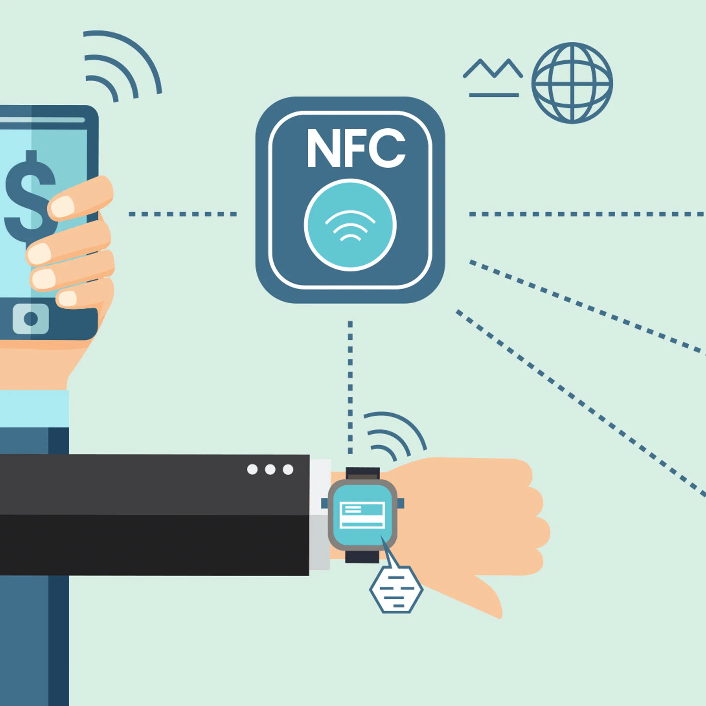

# CaseStudy
### Overview and Origin
## Stripe

**Name of company**

*Stripe*

**When was the company incorporated?**

*Stripe was founded in 2010 by Irish entrepreneur brothers John and Patrick Collison in Palo Alto, California.*

**Who are the founders of the company?**

*The founders of Stipe are Irish brothers John and Patrick Collison. Patrick received the award of Young Scientist of the Year at age 16 for his work on the programming language Lisp. He went on to leave school early to study computer science at MIT. John broke the record for the highest score in the Irish Leaving Certificate. He went on to study computer science at Harvard University.*

*The Collison brothers became millionaires in 2008 when both were under 20 years old, following the sale of their company Auctomatic for $5 million.*

**How did the idea for the company (or project) come about?**

*Patrick started Auctomatic, an auction management system for sellers present on marketplaces such as Amazon and eBay. While the brothers were working on several side projects and they debated why it was so difficult to accept payments on the web. They sought to solve the problem and see if it was possible to make it simple - really simple. The next 6-months they played with it, showed it to friends, and saw how people interacted with it, adjusting changes along the way.*

> “Stripe really did come about because we were really appalled by how hard it was to charge for things online.” - John Collison.

**How is the company funded? How much funding have they received?**

*Stripe has raised a total of $2.55 billion across 19 funding rounds.*

*Their first funding came from Y Combinator, an American seed money startup accelerator. They received $30k from Y Combinator. They then met Peter Thiel (co-founder of PayPal), Peter offered his insights into the payments market and his learnings from PayPal. After their meeting Peter offered to invest $2 million. Peter also added other investors like Michael Moritz and Sequoia Capital.*

>“We are lucky in that we’ve been generating revenue from the start and have never been in the position where we had to raise money. It’s more about looking a year or two ahead and deciding if we want to stay on the current track or go big on some things.” - Co-founder Patick Collison.

*Since 2019 alone, Stripe has raised a total of $1.5 billion across 4 funding rounds.*

*Stripe processes hundreds of billions of dollars each yeah for startups
Over 2.8 million websites worldwide are using Stripe, giving them a 5% market share in the “Payments” category for every website.
Stripe is currently valued at $95.6 billion as of 2021.*

*Below is a quick overview how Stripe has revenue in ten ways.*

### Business Activities

**What specific financial problem is the company or project trying to solve?**

*Stripe has developed an innovative structure that aligns its operations with its customers: as Stripe's customers grow, the pay volume increases. Next, Stripe seeks to expand the world of online companies and reduce the formation of new companies.*

**Who is the company's intended customer?  Is there any information about the market size of this set of customers?
What solution does this company offer that their competitors do not or cannot offer?.**

*Stripe's target market includes both small startups and Fortune 500 giants looking for payments services. Stripe is reported to have more than 2 million customers worldwide.*

*Stripe is leading online payment solutions ahead of their competitors because of its powerful, secure, and developer-friendly technology. Stripe can be added to any website, app, or checkout through user-friendly APIs. Stripe also has over 700 partner integrations.*

*Advanced fraud protection, invoicing and billing software, international payment solutions, and B2B compatibility also push Stripe ahead of Square and PayPal.*

 

 **Which technologies are they currently using, and how are they implementing them?**

 *Stripe developers use Python libraries, one library is used during the authrntication process and it sends keys in each API key request. Apart from Python and its libraies, the system uses Ruby and Scala in it's technological stack.*

 ### Landcscape

 **What domain of the financial industry is the company in?**

 *Stripe is in the domain of payments and billing which refers to the use of advanced technology to provide financial services to consumers and business. From buying and selling, to authenticating electronic payments.*

 **What have been the major trends and innovations of this domain over the last 5-10 years?**

 10 years ago when a company wanted to accept payments online, it had to set up a mechant account. It involved manual tasks that could take days or even weeks. This process involved hurldes like regulations, fees and payment card issuers - all of which became increasingly complex for international transactions.*

 *It has been a fast inovating past 10 years in this space with digital wallets on our smartphones and smartwatches with just a tab away for payments.*

 

 **What are the other major companies in this domain?**

-PayPal

 *PayPal was the first major company in this domain which was adopted quickly by e-comemrce giants Amazon and eBay. PayPal is the most popular online payment processor capturing over 53% of the market share.*

 *PayPal offers online checkout experiences, invoicing, and in-person payments best fit for ecommerce companies that need easy online payments.*

-Square

 *San Francisco based startup Square brought payments innovation to the point of sale, allowing businesses with smaller transaction volumes to accept card payments with its card reader and mobile phone card reader. Square has expanded in recent years as they have integrated point of sale terminals, as well as a broader ecosystem of applications.*

 *Square offers POS systems, online checkout experiences, and invoicing best fit for brick-and-mortar businesses.*

-Adyen
 
 *Adyen is a Ducth payment company that allows businesses to accept e-commerce, mobile and point of ale payments.*

 -2Checkout
 
 *2Checkout is an elctronic payment service that allows merchants to accept online credit card payments.*

 *Stripe's main competitors are PayPal and Square,

 ### Results

 **What has been the business impact of this company so far?**

 *Stripe created a way for businesses to accept payments online with only a few lines of code. The main advantage of Stripe is that while you make a payment, the user stays on the same website rather than being transferred to another website. There are no fixed costs or monthly expenses and immediate suspension is provided. Other advantages: easy installation of standard payments.*

 
 >“We wanted it to be extremely simple to integrate. You should be able to start charging credit cards immediately. There shouldn’t be any latency. You shouldn’t have to talk to anybody. The information you have to give shouldn’t be pages long… Google Checkout and PayPal are these confusing things, and we wondered why they hadn’t solved these issues.” - Co-founder Pattrick Collison

 **What are some of the core metrics that companies in this domain use to measure success? How is your company performing, based on these metrics?**

 *Companies in this domain are very similar yet they focus on different areas in the domain.*

 *Stripe is focused on larger businesses with a technical team or budget that don’t offer any in-person transactions.*
  
 *Square is focused on companies that run a brick and mortar store or work in mostly in-person transactions.*

 *PayPal provides an easy and quick way to send and request money online. You can transfer money (abroad) to family, friends, online shops, and auction sites like eBay.*

 *As Stripe is very similar to PayPal and Square, stripe focuses more with e-commerce. According to eMarketer's, they estimate the global e-commerce market reached $4.3 trillion in 2020. Stripe states that only around 3% of total commerce occurs online.*

 *All three are major competitors but yet measure success in a slighly different way*.

 **How is your company performing relative to competitors in the same domain?**

 *Stripe is valued at US$95 billion, their valuation has increased by 54x since 2014. Since 2016 each year they have revenued $500m a year more than their previous year. In 2020 Stripes total revenue was US$2.5 billion.*

 *Square's market capitalizations is valued at over US$100 billion, their 2020 revenue was US$9.5 billion.*

 *PayPal is valued at US$340 billion, their 2020 revenue was US$21.5 billion*

 ### Recommendations

 **If you were to advise the company, what products or services would you suggest they offer?**

 *I would suggest for Stripe to offer payment services for in store such as retail and hospitality businesses and also mobile transactions.*

 *Stripes installation process can be quite tricky and can be quite difficult setting up, I would suggest to making it more user friendly if possible.*

 *In recent years we have seen a huge rise into the adoption of cryptocurruncies. Allowing payments of several of the top crytocurrencies would benifit them as they will have such a broad payment system.*

 **What technologies would this additional product or service utilize?**

*-Near-Field Communications*

*-Blockchain*

>“If you think of the kind of world that crypto people and we are trying to bring about, I think it’s a very related set of goals".
“We are stuck down at this level where only a fifth of interactions are cross border,” he said. “Crypto is one very exciting direction for trying to solve that.” -
John Collison.

Wrapped BTC Now Holds More Than 1% of Bitcoin’s Circulating Supply
Bitcoin is getting increasingly locked on Ethereum in the form of wrapped BTC, which now holds more than 1% of bitcoin's total circulating supply. This trend shows how savvy crypto traders are pivoting to salvage or maintain returns even as bitcoin's price tumbled. "The Hash" team discusses wrapped BTC gaining popularity and what this means for the bitcoin community.
Volume 90%
 

**Why are these technologies appropriate for your solution?**

*Near-Field Communications is a technology that allows for contactless payments for accepting payments in store. It allows devices to wirelessly communicate at close range to process payments.*

*Blockchain will be used to accept cryptocurrencies as payments. PayPal one of Stripes major competitors recently announced that consumers would be able to pay merchants in the PyPal network with cryptocurrenies.

## References
- 9 best competitors & alternatives to stripe payments 2021. (2021, 4). Merchant Maverick. https://www.merchantmaverick.com/stripe-payments-competitors-and-alternatives/

- Bloomberg. (n.d.). https://www.bloomberg.com/news/articles/2021-03-14/stripe-raises-600-million-valuing-company-at-95-billion

- Bloomberg. (n.d.). https://www.bloomberg.com/news/articles/2021-03-14/stripe-raises-600-million-valuing-company-at-95-billion

- (n.d.). Forbes. https://www.forbes.com/companies/stripe/?sh=52ae68463944
How US fintech stripe is improving online payments for businesses. (2019, June 4). NS Banking. https://www.nsbanking.com/analysis/stripe-fintech-payments-2/

- Nast, C. (2018, October 5). The untold story of stripe, the secretive $20bn startup driving Apple, Amazon and Facebook. WIRED UK. https://www.wired.co.uk/article/stripe-payments-apple-amazon-facebook

- Rooney, K. (n.d.). How stripe, CNBC's No. 1 disruptor 50 company, helped keep the U.S. economy afloat during pandemic. CNBC. https://www.cnbc.com/2020/06/16/why-online-payments-start-up-stripe-is-the-no-1-disruptor-50-company.html

- Rudegeair, P. (2021, April 13). How payment processor stripe became Silicon Valley’s hottest startup. WSJ. https://www.wsj.com/articles/how-payment-processor-stripe-became-silicon-valleys-hottest-startup-11618306201

- Should startups avoid stripe? How we got our account back. (2021, March 11). Kinsta. https://kinsta.com/blog/startups-avoid-stripe/

- Stripe’s SWOT analysis: What are the biggest strengths and weaknesses of stripe? – Wikisme. (n.d.). Wikisme – Wikisme. Retrieved July 2, 2021, from https://www.wikisme.com/stripe-swot/

- Teare, G. (2021, April 19). Under the hood: A closer look at stripe, the most highly valued venture-backed private company in the US. Crunchbase News. https://news.crunchbase.com/news/under-the-hood-a-closer-look-at-stripe-the-most-highly-valued-venture-backed-private-company-in-the-us/

-Top 10 Fintech trends for 2021. (n.d.). Banking and Finance | Software Solutions for Banks & Financial Services. https://www.nelito.com/blog/top-10-fintech-trends-for-2021.html

- Stripe Teardown: How The $36B Payments Company Is Supercharging Online Retail. https://www.cbinsights.com/research/report/stripe-teardown/

- How Does Stripe Make Money (Business and Revenue Model). https://entrepreneur-360.com/how-does-stripe-make-money-14202

- The Collison Brothers and Story Behind The Founding Of Stripe. https://www.startupgrind.com/blog/the-collison-brothers-and-story-behind-the-founding-of-stripe/

- How Stripe Built A $35 Billion Company. https://www.youtube.com/watch?v=s2UBVtqhmEc

- What is Stripe? The financial software you don’t even know you’re using. https://www.youtube.com/watch?v=EwBkiVZuLn4

