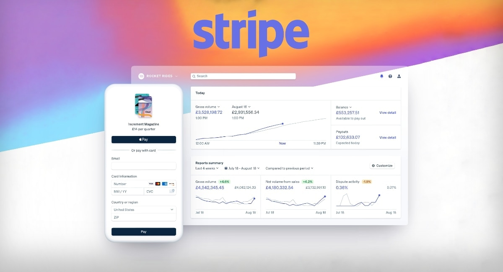
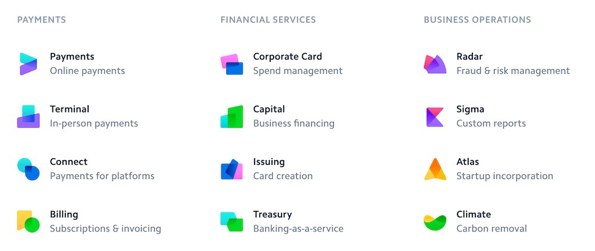

# CaseStudy
### Overview and Origin
## Stripe

**Name of company**

*Stripe*

**When was the company incorporated?**

*Stripe was founded in 2010 by Irish entrepreneur brothers John and Patrick Collison in Palo Alto, California.*

**Who are the founders of the company?**

*The founders of Stipe are Irish brothers John and Patrick Collison. Patrick received the award of Young Scientist of the Year at age 16 for his work on the programming language Lisp. He went on to leave school early to study computer science at MIT. John broke the record for the highest score in the Irish Leaving Certificate. He went on to study computer science at Harvard University.*

**How did the idea for the company (or project) come about?**

*Patrick started Auctomatic, an auction management system for sellers present on marketplaces such as Amazon and eBay. While the brothers were working on several side projects and they debated why it was so difficult to accept payments on the web. They sought to solve the problem and see if it was possible to make it simple - really simple. The next 6-months they played with it, showed it to friends, and saw how people interacted with it, adjusting changes along the way.*

**How is the company funded? How much funding have they received?**

*Their first funding came from Y Combinator, an American seed money startup accelerator. They received $30k from Y Combinator. They then met Peter Thiel (co-founder of PayPal), Peter offered his insights into the payments market and his learnings from PayPal. After their meeting Peter offered to invest $2 million. Peter also added other investors like Michael Moritz and Sequoia Capital.*

*Stripe processes hundreds of billions of dollars each yeah for startups
Over 2.8 million websites worldwide are using Stripe, giving them a 5% market share in the “Payments” category for every website.
Stripe is currently valued at $95.6 billion as of 2021.*

*Below is a quick overview how Stripe makes money.*

### Business Activities

**What specific financial problem is the company or project trying to solve?**

